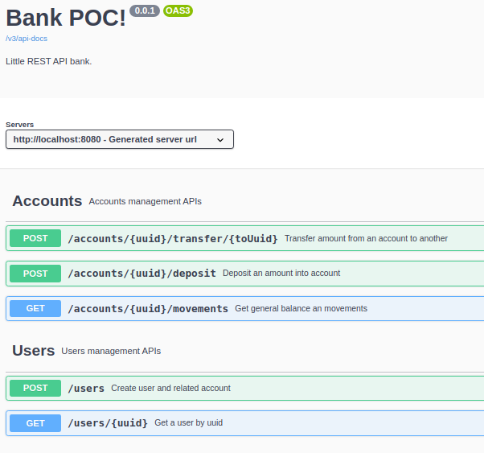

# bank

Little API Bank REST.

## FeatureSet and scope
* User and related account creation.
* Deposit into the user's account.
* Tranfer amount from user's acconunt to another user's account.
* Account's movements and balance.

## Getting Started

Standalone maven based app, run:

```bash
$ export JAVA_HOME=/home/javadev/.jdks/openjdk-20.0.1/
$ mvn spring-boot:run
```

### Prerequisites

* Oracle Open JDK 20.0.0 (only do the export (is session life) if it's not your java version.
* Maven 3.3.9

### DataBase Section

H2 in memory bbdd used.
Access UI H2 Dashboard via: [H2 UI Login](http://localhost:8080/h2-ui/login.jsp) 
* JDBC URL: jdbc:h2:mem:testdb
* No pwd required

## Services exposure




